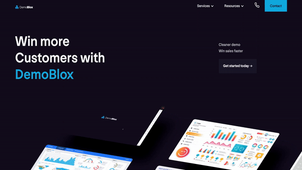

#  DemoBlox 

> A clean, and responsive webpage page for DemoBlox!

> https://demoblox.com

<!--  
 -->

### Website Preview

 
  <kbd>
    
  </kbd>

## Features 📋
⚡️ Fully Responsive\
⚡️ Valid HTML5, CSS3 & JavaScript\
⚡️ JavaScript animation library using `Gsap`\
⚡️ Web translation using `weglot`\
⚡️ Dynamic animations using `webflow`\
⚡️ `Splide.core`\
⚡️ Easy to modify

## Installation & Deployment 📦
- Clone the repository and modify the content of <b>index.html</b> according to your requirement.
- Add or remove images from `demoblox.github.io/assets/img/` directory as per your requirement.
- If want to convert it to a react app, I highly recommend to use [Github Pages](https://create-react-app.dev/docs/deployment/#github-pages) to deploy the website the EASIEST WAY.
- To deploy your website, first you need to create github repository with the same name. Please don't give any other name.
- Push the generated code to the `master` branch of this repository.
- <b>NOTE:</b> Make sure to set `analyticsId` from your Google Analytics account inside the Google Analytics script tag.

## Sections 📚
✔️ Home\
✔️ Services\
✔️ Resources

To view a live **[click here](https://demoblox.github.io/)**

## Tools Used 🛠️
* [<b>GitHub Pages</b>](https://create-react-app.dev/docs/deployment/#github-pages) - To host the website (HTML, CSS, JS).
* [<b>Materialize</b>](https://materializecss.com/) - A CSS framework to get Google's Material Design components.
* [<b>Typed.js</b>](https://mattboldt.com/demos/typed-js/) - JavaScript Library
* [<b>Gsap</b>](https://greensock.com/) - JavaScript Library

## Contributing 💡
#### Step 1

- **Option 1**
    - 🍴 Fork this repo!

- **Option 2**
    - 👯 Clone this repo to your local machine.

#### Step 2

- **Build your code** 🔨🔨🔨

#### Step 3

- 🔃 Create a new pull request.

## Update The Following
* Content; as most of the content used are placeholders
* Contact
* Google analytics
* Meta tag description.

## License 📄
This project is licensed under the MIT License - see the [LICENSE.md](./LICENSE) file for details.
